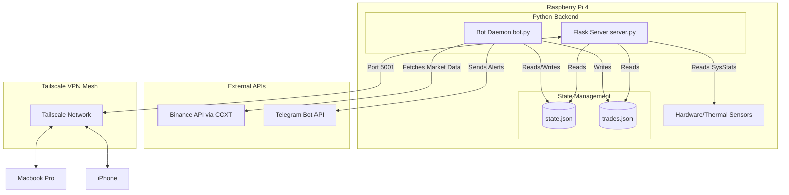
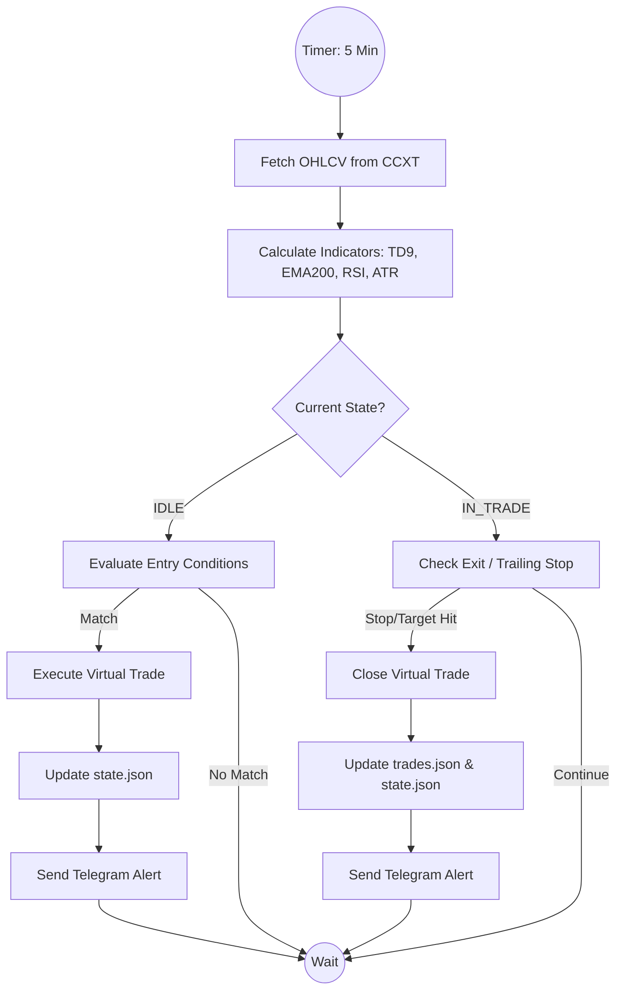

# GaTDSEQ: Quantitative Shadow-Trading & Monitoring System

GaTDSEQ is a lightweight, edge-deployed quantitative monitoring and shadow-trading system designed to run on a Raspberry Pi. This project serves as a technical showcase of integrating market data consumption, custom algorithmic evaluation (TD Sequential, EMA, RSI, ATR), local state management, and edge-device hardware optimization into a cohesive, resilient architecture.

> **Note:** This project is designed as a technical portfolio piece demonstrating systems integration, edge computing, and backend development. It operates strictly in **Shadow Mode** (paper trading) and is not intended or endorsed for actual financial trading.

## System Architecture

The system is designed for high availability and low resource consumption on edge hardware, utilizing a Flask-based backend to serve a live Quant Terminal and a separate Python daemon for continuous market analysis. Remote accessibility is securely managed via a mesh VPN.



## Core Features & Technical Stack

### 1. Market Data & API Integration
- **CCXT Library:** Utilized for robust, standardized communication with the Binance API to fetch OHLCV data.
- **Telegram Bot API:** Integrated via native HTTP requests to push real-time execution alerts, trailing stop updates, and system notifications directly to mobile.

### 2. Shadow Mode Architecture
Rather than risking real capital, the system operates in a simulated "Shadow Mode":
- State transitions (Idle -> In Trade) and virtual executions are serialized locally to `state.json`.
- A persistent ledger of trades is appended to `trades.json`.
- This file-based state management ensures the bot can recover gracefully from power losses or reboots without needing an external database, maintaining simplicity and low overhead.

### 3. Asynchronous Workflow & Bot Logic
The bot operates independently from the web interface, running on a scheduled loop.



### 4. Flask Web Terminal & UI
- **Backend:** A lightweight Flask server exposes RESTful endpoints (`/api/state`, `/api/trades`, `/api/system`, `/api/backtest`).
- **Frontend:** A dependency-free, vanilla HTML/JS/CSS dashboard mimicking a professional quant terminal. It uses long-polling to maintain a live view of the bot's state, virtual portfolio metrics, and hardware utilization.

### 5. Hardware & OS Optimization (Raspberry Pi)
To ensure long-term stability on a resource-constrained ARM device, the underlying Linux environment was heavily optimized:
- **ZRAM Configuration:** Implemented ZRAM (compressed RAM-based swap) to prevent SD card degradation from swap thrashing while extending available memory.
- **Service Pruning:** Disabled unnecessary background services (e.g., Bluetooth, desktop environment features not needed for kiosk mode) to free up CPU cycles and RAM.
- **Chromium Kiosk Mode:** The system can boot directly into a lightweight window manager launching Chromium in Kiosk mode to display the terminal locally, utilizing hardware acceleration where possible.
- **Thermal Monitoring:** The Flask server hooks directly into `/sys/class/thermal/thermal_zone0/temp` and native bash utilities (`vmstat`, `free`) to report real-time hardware telemetry to the dashboard.

### 6. Secure Remote Access
Instead of exposing ports to the public internet, the Raspberry Pi is part of a **Tailscale** zero-trust mesh network. This allows secure, authenticated access to the Flask dashboard (Port 5001) and SSH from any authorized personal device (Mac, iPhone) from anywhere in the world.

## Repository Setup

To run the system locally:

1. Clone the repository and navigate to the directory.
2. Create a virtual environment and install dependencies:
   ```bash
   python3 -m venv .venv
   source .venv/bin/activate
   pip install flask flask-cors ccxt pandas requests
   ```
3. Start the Flask server:
   ```bash
   python3 server.py
   ```
4. Start the bot daemon (in a separate terminal or via tmux/systemd):
   ```bash
   python3 bot.py
   ```

