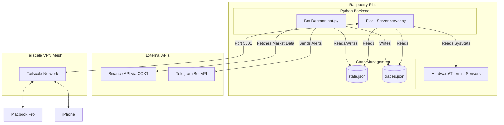
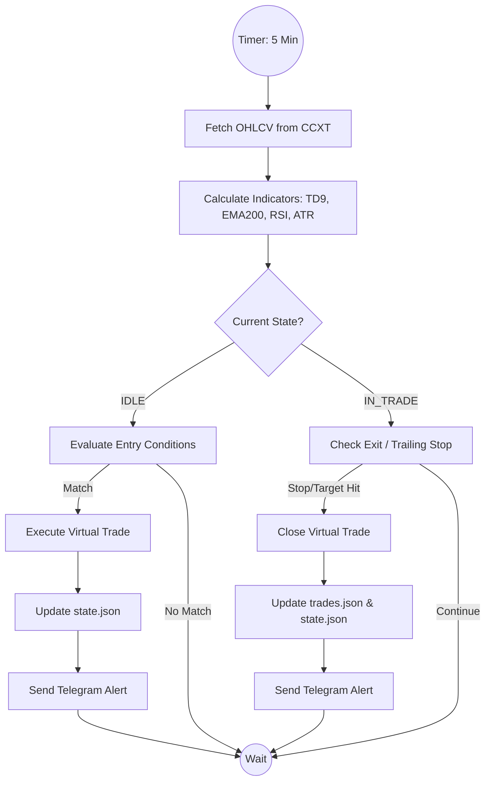

# GaTDSEQ: Quantitative Shadow-Trading & Monitoring System

GaTDSEQ is a lightweight, edge-deployed quantitative monitoring and shadow-trading system designed to run on a Raspberry Pi. This project serves as a technical showcase of integrating market data consumption, custom algorithmic evaluation (TD Sequential, EMA, RSI, ATR), local state management, and edge-device hardware optimization into a cohesive, resilient architecture.

> **Note:** This project is designed as a technical portfolio piece demonstrating systems integration, edge computing, and backend development. It operates strictly in **Shadow Mode** (paper trading) and is not intended or endorsed for actual financial trading.

## System Architecture

The system is designed for high availability and low resource consumption on edge hardware, utilizing a Flask-based backend to serve a live Quant Terminal and a separate Python daemon for continuous market analysis. Remote accessibility is securely managed via a mesh VPN.



## Core Features & Technical Stack

### 1. Market Data & API Integration
- **CCXT Library:** Utilized for robust, standardized communication with the Binance API to fetch OHLCV data.
- **Telegram Bot API:** Integrated via native HTTP requests to push real-time execution alerts, trailing stop updates, and system notifications directly to mobile.

### 2. Shadow Mode Architecture
Rather than risking real capital, the system operates in a simulated "Shadow Mode":
- State transitions (Idle -> In Trade) and virtual executions are serialized locally to `state.json`.
- A persistent ledger of trades is appended to `trades.json`.
- This file-based state management ensures the bot can recover gracefully from power losses or reboots without needing an external database, maintaining simplicity and low overhead.

### 3. Asynchronous Workflow & Bot Logic
The bot operates independently from the web interface, running on a scheduled loop.



### 4. Flask Web Terminal & UI
- **Backend:** A lightweight Flask server exposes RESTful endpoints (`/api/state`, `/api/trades`, `/api/system`, `/api/backtest`).
- **Frontend:** A dependency-free, vanilla HTML/JS/CSS dashboard mimicking a professional quant terminal. It uses long-polling to maintain a live view of the bot's state, virtual portfolio metrics, and hardware utilization.

### 5. Hardware & OS Optimization (Raspberry Pi)
To ensure long-term stability on a resource-constrained ARM device, the underlying Linux environment was heavily optimized:
- **ZRAM Configuration:** Implemented ZRAM (compressed RAM-based swap) to prevent SD card degradation from swap thrashing while extending available memory.
- **Service Pruning:** Disabled unnecessary background services (e.g., Bluetooth, desktop environment features not needed for kiosk mode) to free up CPU cycles and RAM.
- **Chromium Kiosk Mode:** The system can boot directly into a lightweight window manager launching Chromium in Kiosk mode to display the terminal locally, utilizing hardware acceleration where possible.
- **Thermal Monitoring:** The Flask server hooks directly into `/sys/class/thermal/thermal_zone0/temp` and native bash utilities (`vmstat`, `free`) to report real-time hardware telemetry to the dashboard.

### 6. Secure Remote Access
Instead of exposing ports to the public internet, the Raspberry Pi is part of a **Tailscale** zero-trust mesh network. This allows secure, authenticated access to the Flask dashboard (Port 5001) and SSH from any authorized personal device (Mac, iPhone) from anywhere in the world.

## Repository Setup

To run the system locally:

1. Clone the repository and navigate to the directory.
2. Create a virtual environment and install dependencies:
   ```bash
   python3 -m venv .venv
   source .venv/bin/activate
   pip install flask flask-cors ccxt pandas requests
   ```
3. Start the Flask server:
   ```bash
   python3 server.py
   ```
4. Start the bot daemon (in a separate terminal or via tmux/systemd):
   ```bash
   python3 bot.py
   ```


---

# GaTDSEQ: Sistema Cuantitativo de Monitorización y Shadow-Trading (ES)

GaTDSEQ es un sistema de monitorización y shadow-trading cuantitativo y ligero, diseñado para ser desplegado en un dispositivo edge como una Raspberry Pi. Este proyecto sirve como una muestra técnica de integración de consumo de datos de mercado, evaluación algorítmica personalizada (TD Sequential, EMA, RSI, ATR), gestión de estado local y optimización de hardware en dispositivos edge, dentro de una arquitectura cohesiva y resiliente.

> **Nota:** Este proyecto está diseñado como una pieza de portafolio técnico para demostrar integración de sistemas, edge computing y desarrollo de backend. Opera estrictamente en **Modo Shadow** (simulación de operaciones/paper trading) y no está destinado ni respaldado para el trading financiero real.

## Arquitectura del Sistema

El sistema está diseñado para alta disponibilidad y bajo consumo de recursos en hardware edge, utilizando un backend basado en Flask para servir un Terminal Cuantitativo en vivo y un demonio Python separado para el análisis continuo del mercado. El acceso remoto se gestiona de forma segura a través de una VPN mesh.

*(Ver diagrama en la sección en inglés)*

## Características Principales y Stack Técnico

### 1. Datos de Mercado e Integración de API
- **Librería CCXT:** Utilizada para una comunicación robusta y estandarizada con la API de Binance para obtener datos OHLCV.
- **API de Bot de Telegram:** Integrada a través de peticiones HTTP nativas para enviar alertas de ejecución en tiempo real, actualizaciones de trailing stop y notificaciones del sistema directamente al móvil.

### 2. Arquitectura en Modo Shadow
En lugar de arriesgar capital real, el sistema opera en un "Modo Shadow" simulado:
- Las transiciones de estado (Inactivo -> En Operación) y las ejecuciones virtuales se serializan localmente en `state.json`.
- Un libro mayor persistente de operaciones se añade a `trades.json`.
- Esta gestión de estado basada en archivos asegura que el bot pueda recuperarse de cortes de energía o reinicios sin necesitar una base de datos externa, manteniendo la simplicidad y un bajo consumo de recursos.

### 3. Flujo de Trabajo Asíncrono y Lógica del Bot
El bot opera independientemente de la interfaz web, ejecutándose en un bucle programado.

*(Ver diagrama de flujo en la sección en inglés)*

### 4. Terminal Web Flask e Interfaz de Usuario
- **Backend:** Un servidor Flask ligero expone endpoints RESTful (`/api/state`, `/api/trades`, `/api/system`, `/api/backtest`).
- **Frontend:** Un panel de control en HTML/JS/CSS puro, sin dependencias, que imita un terminal cuantitativo profesional. Utiliza long-polling para mantener una vista en tiempo real del estado del bot, métricas del portafolio virtual y uso del hardware.

### 5. Optimización de Hardware y SO (Raspberry Pi)
Para asegurar la estabilidad a largo plazo en un dispositivo ARM con recursos limitados, el entorno Linux subyacente fue fuertemente optimizado:
- **Configuración ZRAM:** Se implementó ZRAM (swap comprimido basado en RAM) para prevenir la degradación de la tarjeta SD por el uso excesivo de la partición swap, mientras se amplía la memoria disponible.
- **Poda de Servicios:** Se deshabilitaron servicios en segundo plano innecesarios (ej. Bluetooth, características del entorno de escritorio que no son necesarias para el modo Kiosk) para liberar ciclos de CPU y RAM.
- **Modo Kiosk de Chromium:** El sistema puede iniciar directamente en un gestor de ventanas ligero que lanza Chromium en modo Kiosk para mostrar el terminal localmente, utilizando aceleración por hardware donde sea posible.
- **Monitorización Térmica:** El servidor Flask se enlaza directamente a `/sys/class/thermal/thermal_zone0/temp` y utilidades nativas de bash (`vmstat`, `free`) para reportar la telemetría del hardware en tiempo real al panel de control.

### 6. Acceso Remoto Seguro
En lugar de exponer puertos al internet público, la Raspberry Pi forma parte de una red mesh zero-trust de **Tailscale**. Esto permite un acceso seguro y autenticado al panel de Flask (Puerto 5001) y a SSH desde cualquier dispositivo personal autorizado (Mac, iPhone) desde cualquier lugar del mundo.

## Configuración del Repositorio

Para ejecutar el sistema localmente:

1. Clona el repositorio y navega al directorio.
2. Crea un entorno virtual e instala las dependencias:
   ```bash
   python3 -m venv .venv
   source .venv/bin/activate
   pip install flask flask-cors ccxt pandas requests
   ```
3. Inicia el servidor Flask:
   ```bash
   python3 server.py
   ```
4. Inicia el demonio del bot (en una terminal separada o vía tmux/systemd):
   ```bash
   python3 bot.py
   ```
